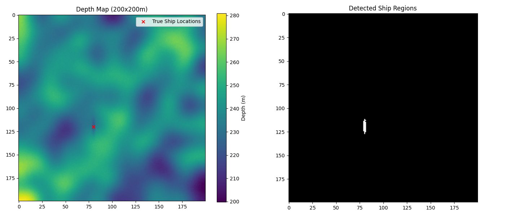

# Sunken Ship Detection

A Python-based tool for detecting sunken ships in underwater depth maps using depth anomaly analysis.

## Description

This project provides tools for identifying potential locations of sunken ships in bathymetric data (sea floor depth maps). The algorithm analyzes depth anomalies to detect ship-sized objects resting on the seafloor.

## Algorithm

The ship detection algorithm works through the following steps:

1. **Smoothing**: Apply Gaussian filtering to the original depth map to create a reference of what the seafloor would look like without anomalies.

2. **Anomaly Detection**: Calculate the difference between the smoothed depth map and the original map. Sunken ships appear as shallower areas (positive anomalies) compared to the surrounding seafloor.

3. **Thresholding**: Apply a threshold to identify regions where the anomaly exceeds a certain value (based on expected ship height).

4. **Size Filtering**: Remove detection regions that are too small or too large to be ships, keeping only those within a plausible size range for the target vessel dimensions.

The algorithm is particularly effective when the approximate dimensions of the target ships are known in advance.

## Synthetic Data Testing

The project includes a module for testing the detection algorithm using synthetically generated data:

- Generates realistic seafloor topography with random variations
- Places virtual ships with specified dimensions at known locations
- Adds sensor noise to simulate real-world measurement conditions
- Visualizes both the synthetic depth map and the detection results
- Compares detection results against known ship positions

This allows for algorithm testing and parameter tuning without requiring real sonar data.

## Usage
To use algorithm with real data you need csv file containing depth map of area with possible ship location, csv file may be extracted from echolot software.
```python
from detect_sunken_ships import detect_ships
import numpy as np

# Load your depth map
depth_map = np.load('your_depth_map.npy')  # or use csv with np.loadtxt()

# Set ship parameters (in meters)
ship_length = 34
ship_width = 7
ship_height = 16  # Height/depth of ship signature

# Detect potential ship locations
ship_mask = detect_ships(depth_map, ship_length, ship_width, ship_height)

# Visualize results
visualize_detection(depth_map, ship_mask, size=depth_map.shape[0])
```

## Requirements
- NumPy
- SciPy
- Matplotlib
To install requirements run
```bash
pip install -r requirements.txt
```

## Demo
To run a demonstration with synthetic data:
```bash
python demo_test.py
```
This will generate a synthetic seafloor with three simulated sunken ships, run the detection algorithm, and display the results.

## Example

Output of test script with one ship with approximate size of the Island-class patrol boat (34x7x16m)